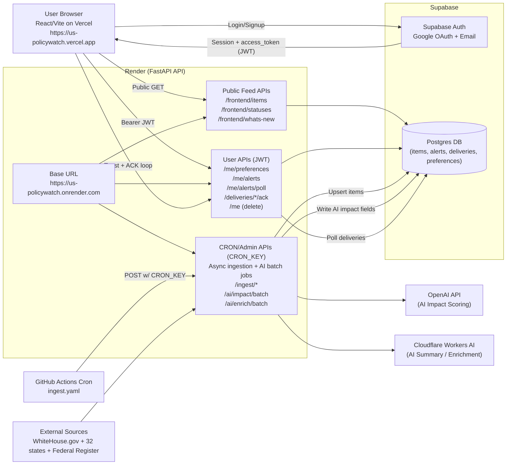
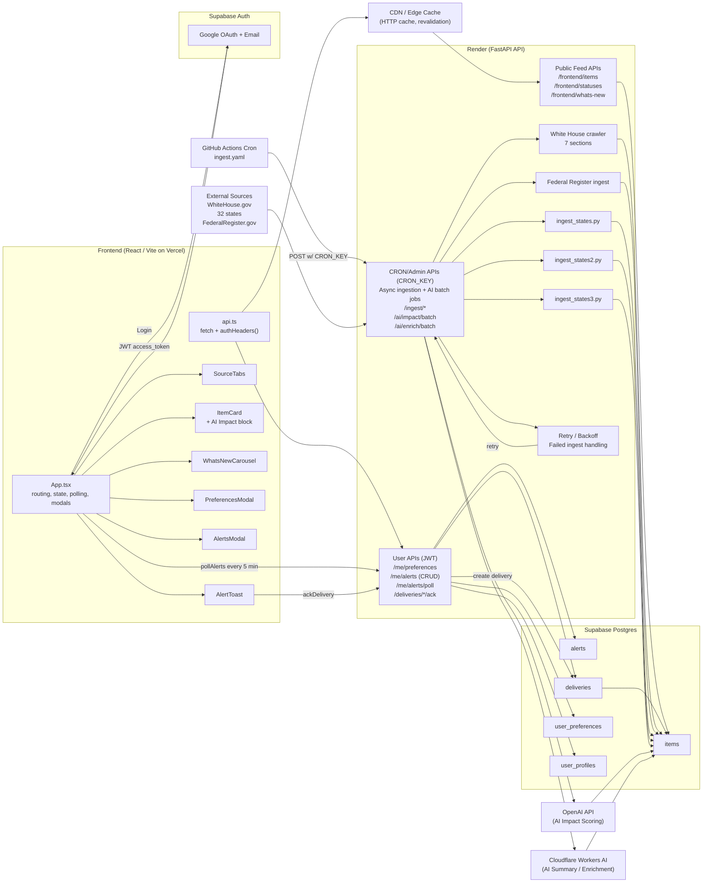

### Diagram A — System Overview

```mermaid
flowchart LR
  U["User Browser<br/>React/Vite on Vercel<br/>https://us-policywatch.vercel.app"] -->|Public GET| FEED
  U -->|Bearer JWT| USER

  subgraph SUPA["Supabase"]
    AUTH["Supabase Auth<br/>Google OAuth + Email"]
    DB[("Postgres DB<br/>(items, alerts, deliveries, preferences)")]
  end

  U -->|Login/Signup| AUTH
  AUTH -->|"Session + access_token (JWT)"| U

  %% Render backend (make URL visible via a node, not the subgraph title)
  subgraph RENDER["Render (FastAPI API)"]
    RURL["Base URL<br/>https://us-policywatch.onrender.com"]

    FEED["Public Feed APIs<br/>/frontend/items<br/>/frontend/statuses<br/>/frontend/whats-new"]
    USER["User APIs (JWT)<br/>/me/preferences<br/>/me/alerts<br/>/me/alerts/poll<br/>/deliveries/*/ack<br/>/me (delete)"]

    CRON["CRON/Admin APIs (CRON_KEY)<br/>Async ingestion + AI batch jobs<br/>/ingest/*<br/>/ai/impact/batch<br/>/ai/enrich/batch"]
  end

  %% AI providers (explicit)
  OA["OpenAI API<br/>(AI Impact Scoring)"]
  CF["Cloudflare Workers AI<br/>(AI Summary / Enrichment)"]

  %% Data links
  FEED --> DB
  USER --> DB

  %% Make the Render box clearly “own” these APIs
  RURL --> FEED
  RURL --> USER
  RURL --> CRON

  %% Schedulers + sources
  GA["GitHub Actions Cron<br/>ingest.yaml"] -->|POST w/ CRON_KEY| CRON
  EXT["External Sources<br/>WhiteHouse.gov + 32 states + Federal Register"] --> CRON

  %% Writes
  CRON -->|Upsert items| DB
  CRON -->|Write AI impact fields| DB

  %% Enrichment calls out to providers
  CRON --> OA
  CRON --> CF

  %% Alerts runtime
  USER -->|Poll deliveries| DB
  U -->|Toast + ACK loop| USER
```

### Diagram B — Data Flow & Internal Components

```mermaid
flowchart LR
  %% ---------- Frontend ----------
  subgraph FE["Frontend (React / Vite on Vercel)"]
    APP["App.tsx<br/>routing, state, polling, modals"]
    API["api.ts<br/>fetch + authHeaders()"]
    TABS["SourceTabs"]
    CARD["ItemCard<br/>+ AI Impact block"]
    WN["WhatsNewCarousel"]
    PREF["PreferencesModal"]
    AM["AlertsModal"]
    TOAST["AlertToast"]
  end

  %% ---------- Auth ----------
  subgraph SA["Supabase Auth"]
    OAUTH["Google OAuth + Email"]
  end

  %% ---------- Edge / Cache ----------
  CACHE["CDN / Edge Cache<br/>(HTTP cache, revalidation)"]

  %% ---------- Backend ----------
  subgraph BE["Render (FastAPI API)"]
    FEEDAPI["Public Feed APIs<br/>/frontend/items<br/>/frontend/statuses<br/>/frontend/whats-new"]

    USERAPI["User APIs (JWT)<br/>/me/preferences<br/>/me/alerts (CRUD)<br/>/me/alerts/poll<br/>/deliveries/*/ack"]

    CRONAPI["CRON/Admin APIs (CRON_KEY)<br/>Async ingestion + AI batch jobs<br/>/ingest/*<br/>/ai/impact/batch<br/>/ai/enrich/batch"]

    ING1["ingest_states.py"]
    ING2["ingest_states2.py"]
    ING3["ingest_states3.py"]
    WH["White House crawler<br/>7 sections"]
    FR["Federal Register ingest"]

    FAILQ["Retry / Backoff<br/>Failed ingest handling"]
  end

  %% ---------- AI Providers ----------
  OA["OpenAI API<br/>(AI Impact Scoring)"]
  CF["Cloudflare Workers AI<br/>(AI Summary / Enrichment)"]

  %% ---------- Data ----------
  subgraph DB["Supabase Postgres"]
    ITEMS["items"]
    ALERTS["alerts"]
    DELIV["deliveries"]
    PREFS["user_preferences"]
    PROFS["user_profiles"]
  end

  %% ---------- Scheduler ----------
  GA["GitHub Actions Cron<br/>ingest.yaml"] -->|POST w/ CRON_KEY| CRONAPI
  SRC["External Sources<br/>WhiteHouse.gov<br/>32 states<br/>FederalRegister.gov"] --> CRONAPI

  %% ---------- Auth flow ----------
  APP -->|Login| OAUTH
  OAUTH -->|JWT access_token| APP

  %% ---------- Read paths (cached) ----------
  API --> CACHE --> FEEDAPI --> ITEMS
  API --> USERAPI
  USERAPI --> PREFS
  USERAPI --> ALERTS
  USERAPI --> DELIV --> ITEMS
  USERAPI --> PROFS

  %% ---------- UI composition ----------
  APP --> TABS
  APP --> WN
  APP --> CARD
  APP --> PREF
  APP --> AM
  APP --> TOAST

  %% ---------- Ingestion (async / batch) ----------
  CRONAPI --> WH --> ITEMS
  CRONAPI --> FR --> ITEMS
  CRONAPI --> ING1 --> ITEMS
  CRONAPI --> ING2 --> ITEMS
  CRONAPI --> ING3 --> ITEMS

  %% ---------- Failure handling ----------
  CRONAPI --> FAILQ
  FAILQ -->|retry| CRONAPI

  %% ---------- AI enrichment ----------
  CRONAPI --> OA --> ITEMS
  CRONAPI --> CF --> ITEMS

  %% ---------- Alerts runtime ----------
  APP -->|pollAlerts every 5 min| USERAPI
  USERAPI -->|create delivery| DELIV
  TOAST -->|ackDelivery| USERAPI
```

